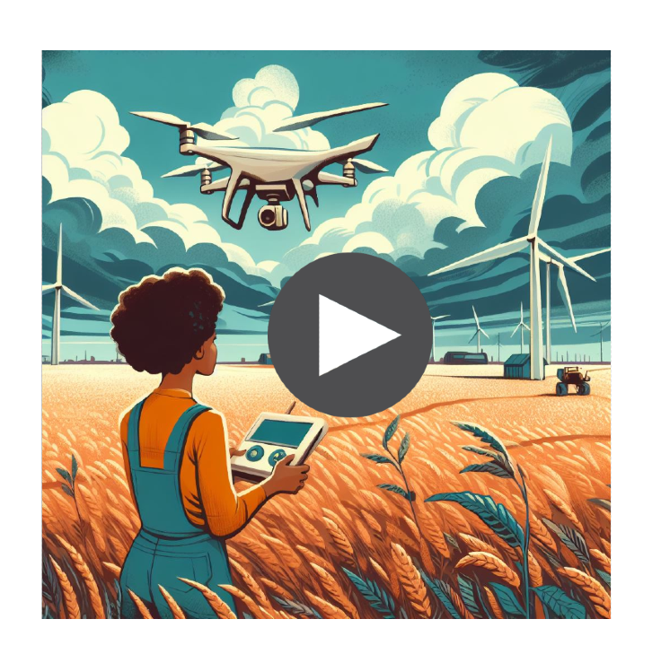
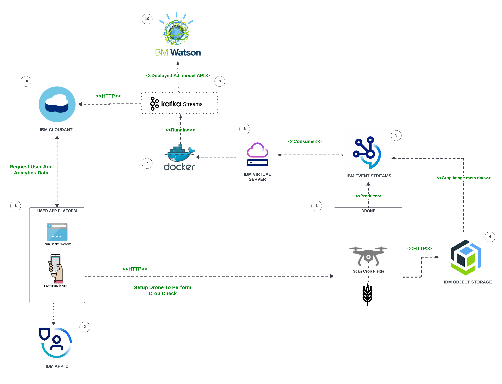

# Introduction:
This is a project build for "IBM - Call For Code" 2023 to 
scan and access the health of a crop field using an autonomous drone to mitigate declining crop yields due to pests, disease and weeds Thus building a more sustainable agricultural sector.

# Youtube Video:

# Roadmap Of Solution:

# Dive Deep Into The Architecture:

1. Front-End platform used to scan and report the health of your crop field with the help of the drone.
2. IBM APP ID used to 
authenticate valid users of the app.		
3. Autonomous IOT drone to scan the crop field using the users custom configurations (ex: farm map, flight schedule)
4. IBM Object Storage is used to store the aerial footage (unstructured data) generated by the drone's camera for further image processing.
5. Kafka Message Queue used to store the meta-data (ex: Drone location, image meta data from IBM Object Storage) of the drones aerial footage which will be used for further image processing by the deployed Yolo A.I. model to assess the health of the crop field.
6. Server used to process the aerial drone footages.
7. Docker used package software for modularity and possible horizontal scaling with the help of Kubernetes.
8. Kafka Streams used to load and process the aerial footages using the deployed Yolo A.I. model.
9. IBM Watson ML is the cloud platform used to host the ML models used for processing (ex: Model for determining if crop has pests, disease or weed).
10. NoSQL database for the app's persistent data (ex: farm maps, drone settings, reports on crop health, etc).

# References:

- https://bsppjournals.onlinelibrary.wiley.com/doi/full/10.1111/j.1365-3059.2010.02411.x
- https://www.pnas.org/doi/10.1073/pnas.2022239118
- https://onehealthoutlook.biomedcentral.com/articles/10.1186/s42522-021-00038-7

