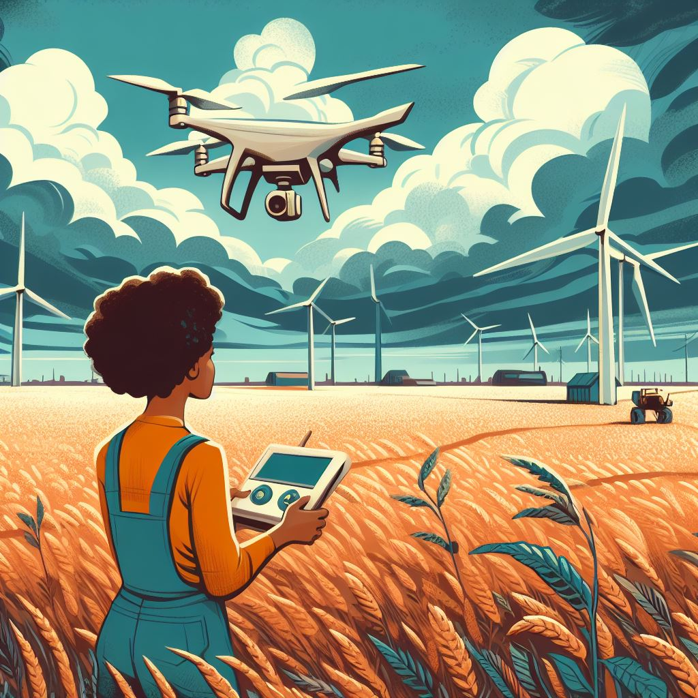

# FarmiHealth:
This is a project build for "IBM - Call For Code" 2023 to 
scan and access the health of a crop field using an autonomous drone to mitigate crop loss due to pests, disease and weed and providing a more sustainable agricultural future.

# Live Video Demo

# Roadmap

1.				2.
2.				4.				
3.				6.
4.				8.
5.				10.
6.				12.

# Architecture:

1.				2.
2.				4.				
3.				6.
4.				8.
5.				10.
6.				12.
7.				6.
8.				8.
9.				10.
10.				12.
11.				8.
12.				10.
13.				12.

# References:

https://bsppjournals.onlinelibrary.wiley.com/doi/full/10.1111/j.1365-3059.2010.02411.x
https://www.pnas.org/doi/10.1073/pnas.2022239118
https://onehealthoutlook.biomedcentral.com/articles/10.1186/s42522-021-00038-7

