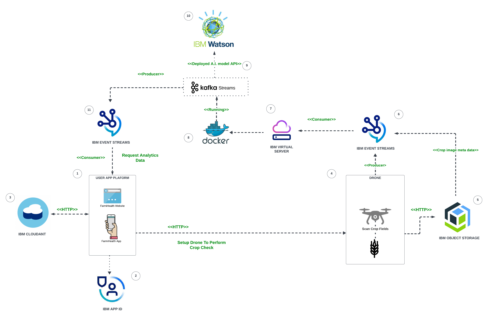

# Introduction:
This is a project build for "IBM - Call For Code" 2023 to 
scan and access the health of a crop field using an autonomous drone to mitigate declining crop yields due to pests, disease and weeds Thus building a more sustainable agricultural sector.

# Video Demo:

# Roadmap:

1.
2.				4.				
3.				6.
4.				8.
5.				10.
6.				12.

# Architecture:

1. Front-End platform used to scan and view the health of your crop field using the autonomous drone.
2. IBM cloud service used to authenticate validate users of the app.				
3. NoSQL database for the apps persistent data such as farm maps, all available user drones and their settings, etc.
4. Autonomous drone that scans the crop field using the custome configurations (farm map, flight schedule) set by the user
5. IBM Object Storage is used to store the arial footage (unstructured data) generated by the drones camera for further image processing
6. Kafka Message Queue used to store the meta-data (Drone location, image meta data from IBM Object Storage) of each sequence of arial drone footage that'll later be processed through the Yolo A.I. model for monitoring crop health.
7. Server used to process the arial drone footage from the drones.
8. Docker used to modularise the execution of the software used for processing
9. Kafka Streams (running on Java) is the application used to load and process all the arial footage produced by the drone camera using the deployed Yolo A.I. models
10. IBM Watson ML is the ccloud platform used to host all the the applications ML models used for inference to determine whether any arial footages contains crops with pests, disease and weed.
11. Kafka Message Queue used to store the processed data containing the health of the crop field. This Queue will be read by the client application (1) using RxJS for near real-time data analysis.

# References:

https://bsppjournals.onlinelibrary.wiley.com/doi/full/10.1111/j.1365-3059.2010.02411.x
https://www.pnas.org/doi/10.1073/pnas.2022239118
https://onehealthoutlook.biomedcentral.com/articles/10.1186/s42522-021-00038-7

